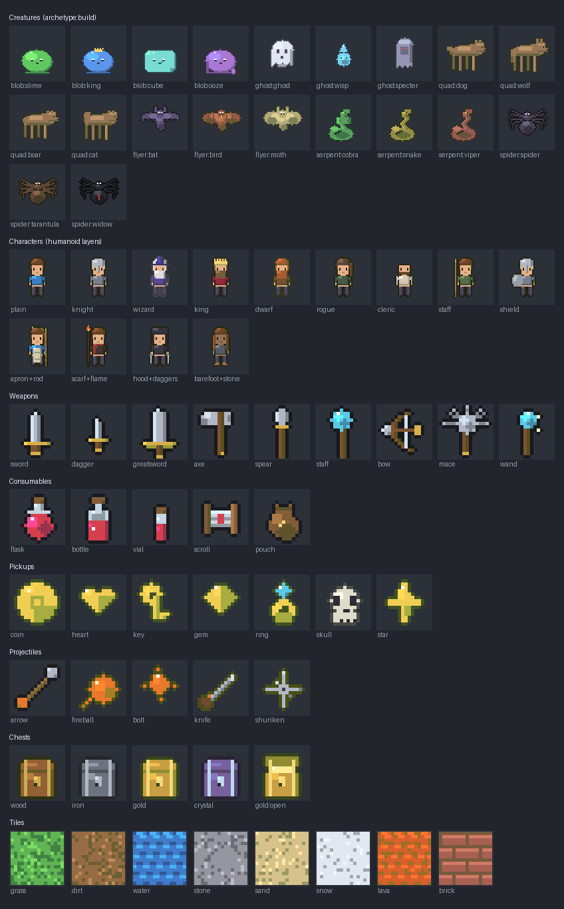

# Sprite library reference

The whole generated sprite vocabulary at a glance. Everything here is a projection
of the generators — no hand-drawn assets — so this sheet is regenerated, never edited.



Regenerate after adding/changing an archetype or build:

```
python tools/contact_sheet.py
```

## The vocabulary

A game's art is **config over this fixed library** (dec-0001/0022): an entity or item
declares `sprite: {archetype, config}`, and the archetype + its `build`/`kind`/`shape`
knob + colours select a sprite. Adding a *variant* is a generator edit; the validated
`archetype` enum (registry ↔ schema) is the only spec-facing surface (dec-0029).

| archetype | class | builds / kinds | animated |
|-----------|-------|----------------|----------|
| `humanoid` | character | hair short/long/ponytail/spiky/bald · beard none/short/full · hat none/cap/wizard/helmet/crown/hood · held none + every weapon (sword/dagger/greatsword/axe/spear/staff/bow/mace/wand) + rod/flamestaff/shield/daggers · garment none/apron/scarf/cloak · feet boots/bare · arms normal/stone · hair_accent none/flora | walk |
| `blob` | enemy | slime · king · cube · ooze | squash idle |
| `ghost` | enemy | ghost · wisp · specter | float idle |
| `quadruped` | enemy | dog · wolf · boar · cat | breathing idle |
| `flyer` | enemy | bat · bird · moth | wing-flap |
| `serpent` | enemy | cobra · snake · viper | tongue/sway idle |
| `spider` | enemy | spider · tarantula · widow | leg-twitch idle |
| `raptor` | enemy | raptor · drake · roc | head-bob idle |
| `beetle` | enemy | beetle · scorpion · mite | skitter idle |
| `weapon` | item_icon | sword · dagger · greatsword · axe · spear · staff · bow · mace · wand | — |
| `consumable` | item_icon | flask · bottle · vial · scroll · pouch | — |
| `pickup` | item_icon / ui | coin · heart · key · gem · ring · skull · star | coin spin |
| `projectile` | item_icon | arrow · fireball · bolt · knife · shuriken | — |
| `chest` | item_icon | wood · iron · gold · crystal (× open/closed) | — |
| `tile` | terrain_tile | grass · dirt · water · stone · sand · snow · lava · brick | — |

Every sprite is built to the one construction standard (dec-0021): named materials →
3-shade hue-shifted ramps, top-left light, selective outline (no colour-count limit). That shared
standard — not a single locked palette — is what makes independently-built assets read
as one game.
