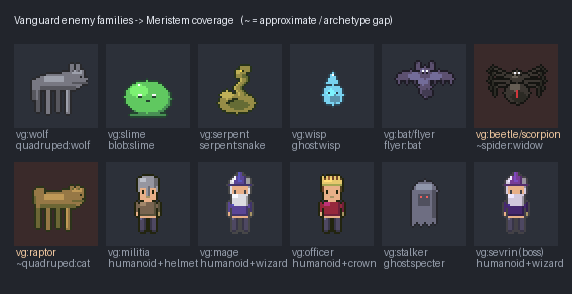

# Sim test: Meristem × Vanguard

A cross-project test — point Meristem's sprite system at **Vanguard** (a Godot 4 GBA/SNES-styled
RPG at `C:\Users\jarms\repos\vanguard`), the project whose style guide Meristem's shading was
ported from. What transfers, what each can learn, where Meristem's design is validated or exposed.

## Lineage (exact)

Meristem's `shading.py` is a **direct port** of Vanguard's `docs/sprite_style_guide.md` §2.3 —
identical hue-shift math: shadow `lerp(h, 0.65, amount*0.3)` (cool + desaturate + darken),
highlight `lerp(h, 0.15, amount*0.4)` (warm + saturate + brighten). Same 15-colour budget,
3-shades/material, top-left light, selective-outline intent, silhouette-first, chibi anatomy.

## The test: enemy-family coverage

Vanguard's `enemy_sprite_generator.gd` collapses ~24 enemy IDs into **~13 family archetypes**
recolored by a `base_color` — *independently the same "sprites are config over a fixed library"
pattern as Meristem* (dec-0001/0022). Mapping those families onto Meristem's bestiary:

**10 of 12 families covered strongly** (wolf→`quadruped:wolf`, slime→`blob`, serpent→`serpent`,
wisp→`ghost:wisp`, bat→`flyer:bat`, stalker→`ghost:specter`, militia/mage/officer/boss→`humanoid`
+ hats). **2 gaps** (red): raptor (a **biped beast** — Meristem has only 4-leg quadruped) and
beetle/scorpion (an **armored bug** — Meristem's spider is a round arachnid). Every Meristem
sprite here is hue-shifted and gate-valid.

## What the test validates about Meristem

- **The family-archetype thesis is not idiosyncratic.** A separate, human-authored RPG converged
  on the same structure (families recolored by config). Meristem's dec-0022 is a real pattern.
- **Meristem is *more* disciplined than its own source.** Vanguard's style guide mandates hue-shift
  ("never define shadow/highlight manually — always derive"), but its `enemy_sprite_generator.gd`
  uses **pure brightness scaling** (`_darker`/`_lighter`, no hue-shift at all), and even the party
  generator applies the correct `_shadow`/`_hilight` inconsistently. Meristem makes the discipline
  **structural** (`Ramp` is the only way to shade) and **enforced** (the asset gate rejects >15
  colours / soft alpha), so it *can't* drift the way Vanguard's enemies did.
- **Distinct bosses share silhouettes in Vanguard** (three Sevrin phases reuse `_draw_sevrin`).
  Meristem's build-knobs + colour give more silhouette separation for the same effort.

## What Meristem can learn from Vanguard (with tradeoffs)

1. **Per-material selective outlining.** Vanguard's `_sel_outline(c) = _shadow(c, 0.5)` outlines each
   edge with the *adjacent material's* dark shade; Meristem uses one `outline_dark()` for the whole
   sprite. Real quality win — but it **costs colours** (one dark per bordering material), which is
   exactly why Meristem simplified. Adopt as an **opt-in for colour-headroom classes** (single-
   material creatures/items), keep single-outline for the humanoid (see `con-001`). Not a blind port.
2. **Shade-sharing to relax the material cap.** Vanguard's guide: "boot dark = hair dark" to fit more
   materials in 15 colours. This directly loosens `con-001` (humanoid ≈5 materials): a `boots`/`gloves`
   layer whose darkest shade *reuses* another material's shade could add a 6th material in-budget.
3. **Richer animation vocabulary.** Vanguard specifies secondary-motion lag (hair/cape bob a frame
   late), attack wind-up→strike→follow-through, and hit = knockback + white flash. Meristem's motion
   is a single uniform idle loop — fine for now (no combat), a clear roadmap when it lands.
4. **Taller humanoid canvas.** Vanguard uses **32×48** for overworld characters (better proportions);
   Meristem crams the humanoid into 32×32 (chibi-cramped). A per-class canvas of 32×48 for characters
   would improve anatomy — but touches the gate/compiler/LDtk, so it's a real design change.
5. **Boss variants.** Vanguard pairs `_draw_wolf` with a boss variant. A `boss: true` modifier
   (bigger, extra spikes/crown, darker palette) over any creature build is a natural knob.

## What Vanguard can learn from Meristem

- **An automated asset gate.** Vanguard's guide relies on the human eyeballing the 15-colour rule
  ("the AI cannot see the rendered result"); its enemy gen quietly broke the hue-shift rule. A
  Meristem-style gate (colour budget / hard alpha / palette) run over the generated `Image` would
  have caught both. Portable as a ~60-line GDScript check or an offline Python lint over exported PNGs.
- **Structural hue-shift.** Route *all* Vanguard shading through the `_shadow`/`_hilight` pair (the
  enemy generator especially) instead of `_darker`/`_lighter`, so enemies match the party's warmth.
- **Spec-addressable builds + animation-as-data.** Vanguard's families are hardcoded `match` arms;
  Meristem's registry + `sprite_catalog()` makes them data an author can discover and validate.

## Concrete gaps this surfaced (candidate Meristem work)

- **`raptor` archetype** — a biped beast (2 legs, tail, snout); no current archetype covers it.
- **`beetle`/`scorpion` archetype** — armored carapace, 6 legs, pincers/tail; distinct from `spider`.
- **Opt-in selective outline** for single-material classes.
- **Shade-sharing** support to relax the humanoid material cap (`con-001`).
