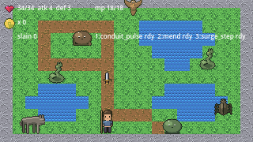

# Vanguard — the Greenweald Detour

A second example manifest, built from a **real game's design docs** rather than invented for the
tool. It is Act 1 scene 1-7 of [Vanguard](https://github.com/jarmstrong158/vanguard), an optional
marsh dungeon: agitated wildlife, medicinal herbs, and Tova's empty cottage where Lida's rod is
found.

Everything in it is taken from Vanguard's own documents — the enemy stat lines are the E1 tier
verbatim, the gear is the T1 Thornwall list, the currency is "Marks".

```
python -m meristem_compiler examples/vanguard-greenweald/manifest.json --out build/greenweald
```



## Why it exists

`slice-01` is a deliberately small vertical slice that proves the pipeline runs. This one asks a
harder question: **can the tool express content it did not have a say in?**

It exercises nearly the whole feature set at once — six enemy types across five archetypes with
three different AIs, solid water as level geometry, two rooms joined by doors both ways, gear that
changes the swing, drop tables with a miss chance, and three abilities with resource costs.

All seven engine assertions pass against Vanguard's own numbers.

## What it does not cover

Vanguard is turn-based; this compiles to real-time action, because that is the only control scheme
the compiler emits. Elements, status effects, enemy abilities, NPCs, the party and shops could not
be expressed at all.

The full accounting — what transferred, what didn't, and what it suggests Meristem should grow
next — is in [`docs/reference/vanguard-fit.md`](../../docs/reference/vanguard-fit.md).
